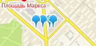
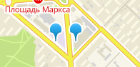
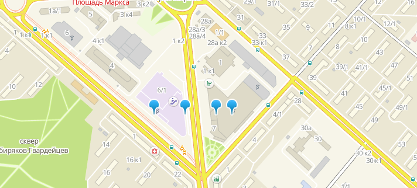

## Test task for 2gis job

The job: https://novosibirsk.hh.ru/vacancy/19466627

## The problem

When you add markers to map they can run into each other:



You need to hide extra markers then they could be placed without collapse:



But if you zoom in and it will be enough place for extra markers they should be shown:



## How to build

To build it you need Node.js 6+

```
npm install
npm run build
```

Then open `public/index.html`

## If I start this project today

Current project have major problems: super big js bundle size, slow sorting algorithm
and slow markers painting (as they're DOM elements).

- For fast sorting I would use [2gis/general](https://github.com/2gis/general).
- For fast marker drawing I would use [2gis/markerdrawer](https://github.com/2gis/markerdrawer).
- I would drop [react](https://github.com/facebook/react). Maybe I would use [preact](https://github.com/developit/preact).
- I would use native [2gis/mapsapi](https://github.com/2gis/mapsapi).
